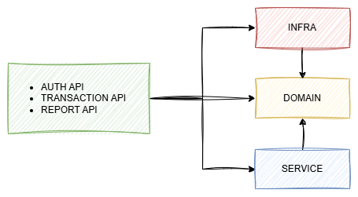
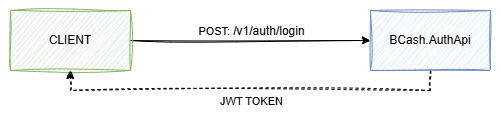
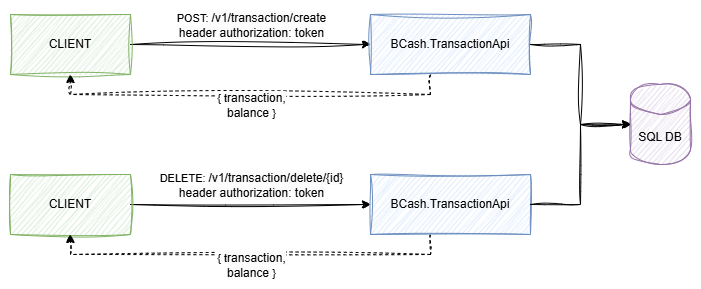
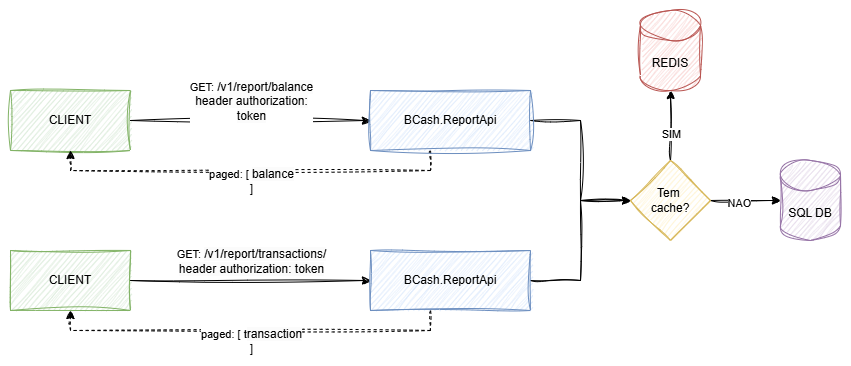

# BCash

Projeto de gestão de fluxo de caixa escrito na versão ASP.NET Core 8, implementando os conceitos de S.O.L.I.D, Clean Code e DDD.

## **Tecnologias**

- ASP.NET Core 8
- Entity Framework Core 8
- Unit & Integration Tests + xUnit
- AutoMapper
- ~~Swagger UI~~
- OpenApi
- HealthChecks
- SQL Server
- Redis (Cache)
- Docker & Docker Compose

## **Arquitetura**



- AUTH API (BCash.AuthApi): Gerencia a autenticação de usuários.
- TRANSACTION API (BCash.TransactionApi): Responsável pelo gerenciamento de transações financeiras.
- REPORT API (BCash.ReportApi): Fica encarregado da geração de relatórios.
- DOMAIN (BCash.Domain): Responsável pelas entidades e interfaces.
- INFRA (BCash.Infrastructure): Responsável pela comunicação com o banco de dados SQL Server.
- SERVICE (BCash.Service): Responsável pela integração entre a camada DOMAIN e a camada INFRA.


## **BCash.AuthApi**



O cliente envia uma requisição ao serviço de autenticação, fornecendo nome de usuário e senha. Em resposta, o serviço de autenticação retorna um token JWT válido por uma hora, que pode ser utilizado nos serviços de transação e geração de relatórios.

Usuário de teste:

username=admin
password=password

## **BCash.TransactionApi**



Para criar uma transação, o cliente deve possuir um token JWT válido e enviá-lo ao serviço de criação de transações, junto com as seguintes informações: valor, data, tipo de transação (D para débito ou C para crédito) e uma descrição opcional. O serviço então registra a transação, atualiza o saldo consolidado do dia e retorna tanto a transação criada quanto o saldo atualizado.

Para cancelar uma transação, o cliente deve fornecer um token JWT válido e enviá-lo ao serviço de exclusão de transações, juntamente com o ID da transação. O serviço então remove a transação, atualiza o saldo consolidado do dia e retorna a transação excluída, além do saldo atualizado.

## **BCash.ReportApi**



Para gerar o relatório de saldo consolidado por dia ou relatório de transações, o cliente deve fornecer um token JWT válido, especificar o período desejado e os parâmetros de paginação. O serviço de relatório verifica se os dados estão em cache; caso existam, retorna as informações armazenadas. Caso contrário, busca os dados no banco de dados, armazena-os no cache para futuras consultas e retorna o resultado.

### Swagger  

O Swagger foi configurado para gerar automaticamente a documentação da API e permitir a interação com endpoints protegidos por autenticação JWT.  

**URLs do Swagger no ambiente de desenvolvimento:**  
- **BCash.AuthApi:** [http://localhost:8081/swagger](http://localhost:8081/swagger)  
- **BCash.TransactionApi:** [http://localhost:8082/swagger](http://localhost:8082/swagger)  
- **BCash.ReportApi:** [http://localhost:8083/swagger](http://localhost:8083/swagger)  

## MiniProfiler for .NET

Para acessar a página com os indicadores de desempenho e performance:
`http://localhost:8081/profiler/results-index`, `http://localhost:8082/profiler/results-index` e `http://localhost:8083/profiler/results-index`.


## Configurando Banco de dados

Por padrão é utilizado o SQL Server do docker, para alterar a conexão, modifique o valor da chave `DefaultConnection` no arquivo `appsettings.Development.json`

```json
{
  "ConnectionStrings": {
    "DefaultConnection": "Data Source=host.docker.internal,1433;Initial Catalog=bcash;User ID=sa;Password=TrustServerCertificate=True;",
    "Collation": "Latin1_General_CI_AI"
  }
}
```


## Executando a aplicação usando o Docker

```bash
docker compose -f docker-compose.yml up -d --build
docker compose -f docker-compose.application.yml up -d --build
docker build -f ./src/BCash.TransactionApi/Dockerfile.migration -t bcash-migration .
docker run --rm --network bcash-network bcash-migration
```